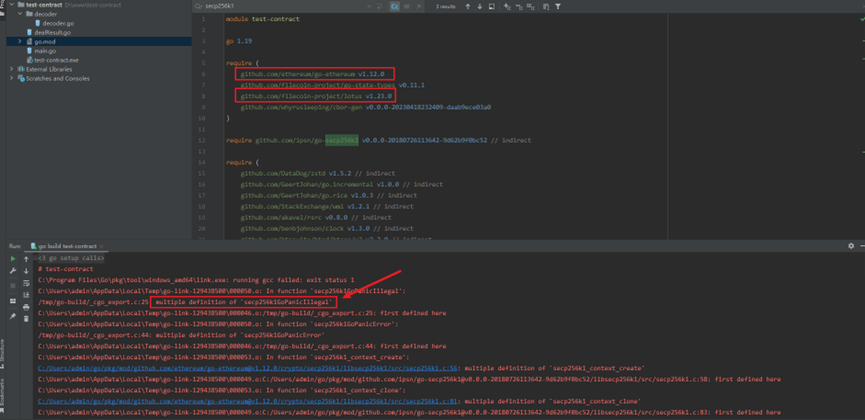

filecion去中心化金融项目后端go代码

注:直接编译会报错

原因是因为lotus和eth都是用了crypto包，调用的底层的C语言方法
secp256k1_context_create重复定义，因此无论是编译还是执行main函数都会报错。
解决方案，在编译的时候添加命令：
--ldflags '-extldflags "-Wl,--allow-multiple-definition"'

即编译变为：
### go build --ldflags '-extldflags "-Wl,--allow-multiple-definition"'
同样的，运行main函数也改为
### go run --ldflags '-extldflags "-Wl,--allow-multiple-definition"' main.go
即可正常编译和运行